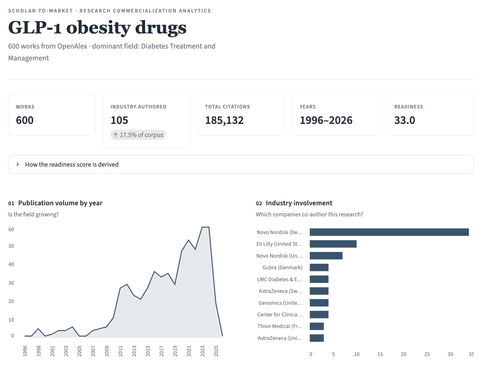
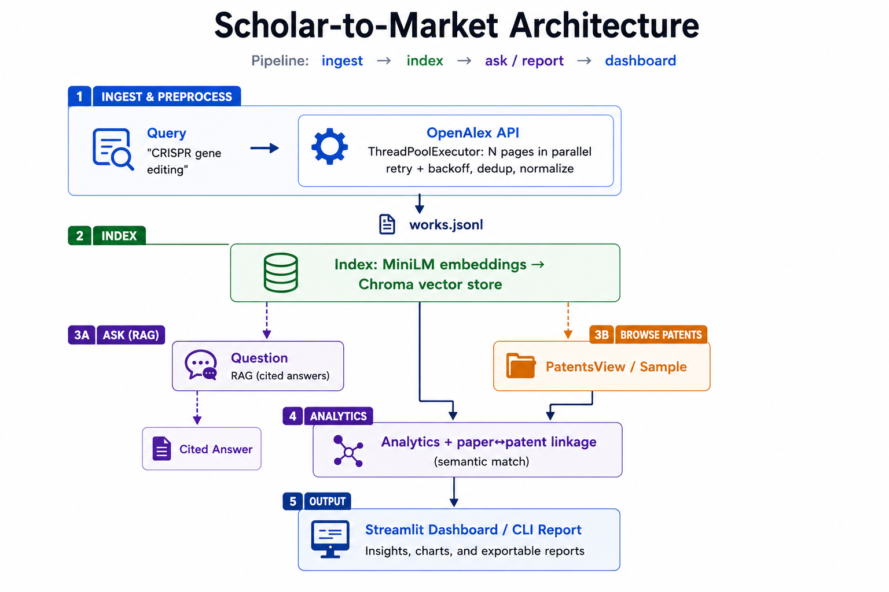
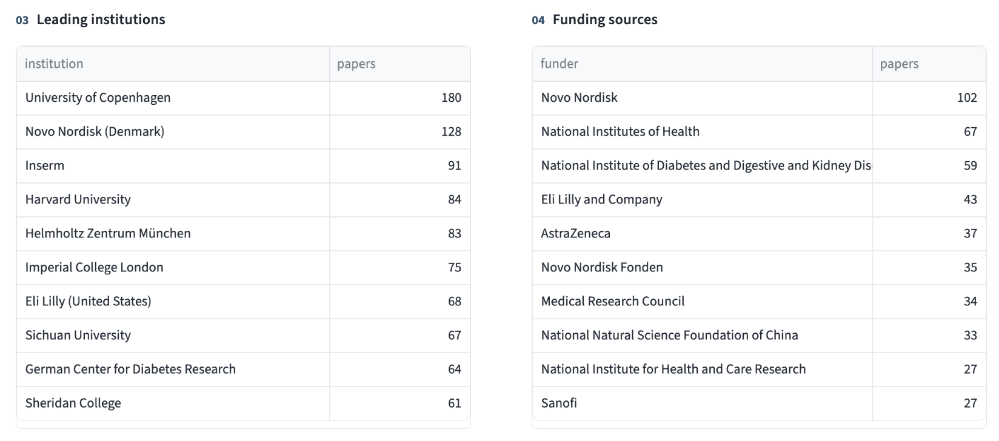
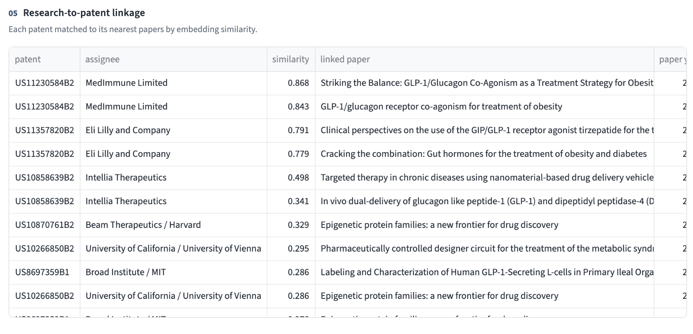

# Scholar-to-Market

**Linking academic research to commercialization signals.** A data pipeline that
ingests scholarly works from **OpenAlex** (and **USPTO patents**), indexes them
for retrieval-augmented Q&A, and computes commercialization analytics — which
labs, companies, and technologies are moving discoveries toward market.

Built as a tech-scouting tool for research-commercialization: *given a research
area, who is publishing, which companies are involved, what patents exist, and
what does the literature actually say?* Point it at **any field** — CRISPR gene
editing, GLP-1 obesity drugs, solid-state batteries, humanoid robots — and it
builds the corpus on demand from a query. The examples below use **CRISPR / gene
editing**, a canonical academia-to-startup pipeline (Editas, Intellia, Caribou,
Beam, Prime Medicine).



---

## Why this exists / what it demonstrates

| Capability | Where it lives |
| --- | --- |
| **Multithreaded ingestion** of a large public dataset | [`ingest/openalex.py`](src/scholar_to_market/ingest/openalex.py) — `ThreadPoolExecutor` fan-out over API pages with retry/backoff |
| **Working with named innovation datasets** | OpenAlex (250M+ works) + USPTO patents |
| **LLM-based tooling** | Retrieval-augmented, **cited** Q&A over the corpus ([`rag.py`](src/scholar_to_market/rag.py)) |
| **Turning raw fields into decision metrics** | Commercialization-readiness score, industry involvement, citation momentum ([`analytics.py`](src/scholar_to_market/analytics.py)) |
| **Entity linkage** | Paper ↔ patent matching via semantic search |
| **Reporting / dashboards** | Streamlit dashboard + CLI report |
| **Software rigor** | `src/` package, typed code, `pytest` suite, GitHub Actions CI |

> OpenAlex also publishes a full **~400 GB snapshot** (S3); the same
> `normalize_work` logic streams snapshot partitions when you need to go past the
> API's 10k-record window — the design scales from a live slice to the full corpus.

---

## Architecture



**Pipeline:** `ingest` → `index` → `ask` / `report` / dashboard.

---

## Quick start

Requires **Python 3.10+**.

```bash
git clone https://github.com/joshuatreepaik/scholar-to-market.git
cd scholar-to-market
python -m venv .venv && source .venv/bin/activate
pip install -e ".[dev]"

cp .env.example .env      # add an LLM key for the `ask` step (see below)
```

Run the pipeline:

```bash
# 1) Ingest ~600 CRISPR works from OpenAlex (multithreaded), + sample patents
s2m ingest "CRISPR gene editing" -n 600 --patents

# 2) Embed them into the local vector store
s2m index

# 3) Commercialization report (companies, funders, paper↔patent linkage)
s2m report

# 4) Ask a cited question over the corpus
s2m ask "Which companies are developing in vivo CRISPR therapies?"
```

### Dashboard

Or do it all from the browser:

```bash
streamlit run src/scholar_to_market/dashboard/app.py
```

The dashboard headlines whichever topic is loaded and shows, in one view:

- **Overview metrics** — works, industry-authored share, citations, and a
  commercialization-readiness score with a transparent breakdown.
- **Publication trend** and **top industry players** charts.
- **Leading institutions** and **funding sources** tables.
- **Research-to-patent linkage** — each patent matched to its nearest papers.
- **Ask the corpus** — a cited RAG answer box.

A **Corpus** side panel lets you rebuild the whole view on a new field without
touching the terminal: click a trending-topic chip (or type any query), set the
size, and hit **Ingest & reindex**. Everything re-fetches from OpenAlex and
re-embeds live.

Leading institutions and funding sources for the loaded topic:



Research-to-patent linkage — each patent matched to its nearest papers by
semantic similarity (here, MedImmune and Eli Lilly GLP-1 patents linked to
GLP-1/obesity papers):



### Credentials

- **OpenAlex** — no key needed; set `OPENALEX_MAILTO` to join the faster "polite pool."
- **LLM** (for `ask`) — any OpenAI-compatible endpoint. Set `LLM_API_KEY`,
  `LLM_BASE_URL`, `LLM_MODEL` in `.env` (OpenAI, a university GenAI gateway, or a
  local GPT4All/Ollama server all work).
- **Patents** — three sources, tried in priority order:
  1. **USPTO Open Data Portal API** (live, any topic) — set `USPTO_ODP_API_KEY`.
     Get a free key from the [ODP Getting Started page](https://data.uspto.gov/apis/getting-started);
     the client queries granted patents by invention title for the loaded topic.
     (USPTO retired the legacy PatentsView Search API during the ODP transition.)
  2. **Bulk dataset** (keyless, offline) — download `g_patent.tsv` from
     [PatentsView](https://patentsview.org/download/) and set `PATENTSVIEW_BULK_TSV`;
     the loader streams the multi-GB file line-by-line.
  3. **Curated reference set** (default) — a bundled file of real granted patents
     spanning the trending topics, so linkage runs for any of them with no setup.

---

## Sample output

`s2m report` on a 600-work CRISPR slice:

```
=== Top companies (industry involvement) ===
              BGI Group (China)   5
    Editas Medicine (US)          4
    Integrated DNA Technologies   3
    ToolGen (South Korea)         3
    Intellia Therapeutics (US)    2

=== Commercialization readiness ===
{ "score": 28.5,
  "components": { "recent_activity": 0.338,
                  "industry_involvement": 0.125,
                  "citation_momentum": 0.498 } }

=== Paper↔patent linkage ===
[US10266850B2] RNA-directed target DNA modification — Univ. of California
    ~0.76  [W2153344788] RNA-programmed genome editing in human cells (2013)
```

That last line is the point: a foundational **UC Berkeley patent** automatically
linked to the **Doudna lab's 2013 paper** — the academic→IP bridge, found by
semantic search.

---

## Project layout

```
scholar-to-market/
├── src/scholar_to_market/
│   ├── config.py              # env-driven settings
│   ├── ingest/
│   │   ├── openalex.py        # multithreaded works ingestion
│   │   └── patents.py         # USPTO ODP / bulk TSV / reference set
│   ├── index.py               # embed → Chroma
│   ├── rag.py                 # retrieval + cited synthesis
│   ├── analytics.py           # metrics, readiness, paper↔patent linkage
│   ├── dashboard/app.py       # Streamlit UI
│   ├── samples/               # curated reference patents
│   └── cli.py                 # `s2m` entry point
├── tests/                     # pytest unit tests (no network)
├── docs/                      # architecture diagram + dashboard screenshots
├── .streamlit/config.toml     # dashboard theme
├── .github/workflows/ci.yml   # lint + test on every push
└── pyproject.toml
```

`data/` and `chroma_store/` (the ingested corpus and vector index) are generated
at runtime and git-ignored.

## Tech stack

**Python** · [OpenAlex API](https://docs.openalex.org/) ·
[PatentsView](https://patentsview.org/) · [ChromaDB](https://www.trychroma.com/) ·
[sentence-transformers](https://www.sbert.net/) · [Streamlit](https://streamlit.io/) ·
[Altair](https://altair-viz.github.io/) · pandas · OpenAI-compatible LLM client.

## Notes & limitations

- The readiness score is an **illustrative** composite, not a validated index —
  it shows how dataset fields become a decision-support metric.
- The live API path caps at OpenAlex's 10k-record paging window; larger runs use
  the snapshot (see note above).
- Paper↔patent links are semantic (embedding similarity), so treat them as
  candidate leads to verify, not ground truth.

## License

MIT — see [LICENSE](LICENSE).
